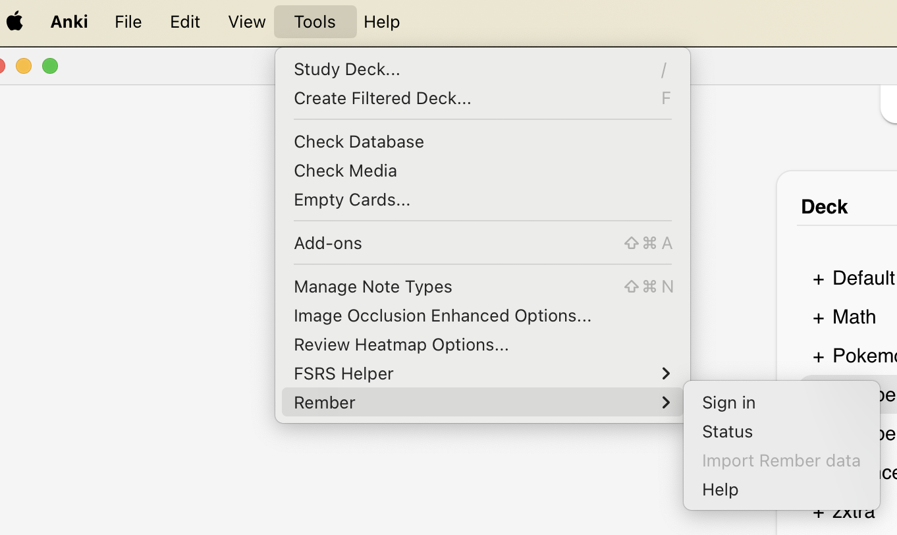

# Anki add-on for Rember

This add-on imports flashcards from [Rember](rember.com) into Anki. It converts rembs into Anki notes that can be reviewed in Anki.

The add-on adds a `Tools > Rember` menu to Anki. After signing in with your Rember account, the add-on imports your Rember flashcards before each Anki sync. The flashcards are stored in a "Rember" deck, but you can move them to other decks.

The add-on only imports rembs. It does not import decks, review history, or remb pause/unpaused states. This keeps the Anki and Rember systems separate, allowing you to manage your reviews in Anki while using Rember for content creation.

Note that Anki add-ons are only supported on Anki Desktop. The iOS version of Anki and AnkiDroid (Android) do not support add-ons, so this add-on will not work on those platforms.



## Develop

- Clone the repo.

- Copy `.env.example` to `.env` and fill the variables.

- Install [Nix](https://nixos.org/).

- Run `nix develop -c $SHELL` to start a development shell. This happens automatically if you use [direnv](https://direnv.net/).

Run `make dev` to createa `rember-anki-sync-dev` add-on in Anki, which you can use to test the add-on after making changes.

Run `make package` to create a `rember-anki-sync.zip` file which can be uploaded to [AnkiWeb](https://ankiweb.net/shared/addons).

Run `make update-app-anki` to update the `src/app_anki` folder, it assumes that the private `rember` repo lives next to the project folder.

## Notes

We use Python 3.9 because that's the version currently used in the Anki repo.

We install packages with `uv` only for type checking, the code is currently only executed by Anki.

Users sign up with their Rember account following the best practices described in [RFC 8252 - OAuth 2.0 for Native Apps](https://datatracker.ietf.org/doc/html/rfc8252): we use the authorization code grant with PKCE in an external browser and use the loopback interface to receive the OAuth redirect. Once we obtain auth tokens, we store them in the user profile. Anki stores AnkiWeb and AnkiHub auth tokens in the user profile as plain text, see for example [`sync_login`](https://github.com/ankitects/anki/blob/d3d6bd8ce006f178e2271fd8d317fdc8832095df/qt/aqt/sync.py#L320-L321).

The `src/app_anki` folder contains the bundle for the `@rember/app-anki` package in the private `rember` repository. It's included in this repository using Git LFS and is used in the Rember note model.

### The Rember note model

In Anki, users review cards and edit notes.
Clozes are great examples of the distinction: you can add three clozes to a single note and three cards will be generated. You will then review each card individually, never the entire note.

In Anki, a _model_ (or _note type_) is associated with each note; it mainly describes the fields and the templates.

In the "Add" interface, you can pick the model by changing the "Type" in the top-left corner. The fields are the text boxes, with their names on top. Anki will use the model's templates to generate one or more cards from the note. A _template_ is a set of instructions for combining note fields into cards.

For instance, the `Basic (and reversed card)` model contains the fields `Front` and `Back` and has two templates, one for the front->back card and one for the back->front card.

Each template contains two HTML pages, one for the front of the card and one for the back of the card.
The HTML can contain "replacements", special sequences of characters that are used to fill note-specific data.

For instance, in the `Basic` model there is a single template, the front HTML page is

```
{{Front}}
```

and the back HTML page is

```
{{FrontSide}}

<hr id=answer>

{{Back}}
```

For more information, see https://docs.ankiweb.net/templates/fields.html#field-replacements.

In Anki, a note generates one or more cards.
In Rember, one or more cards are associated with a remb.
Therefore, for each remb we export an Anki note and for each Rember card we export an Anki card.

It's tricky to get Anki to generate the correct number of cards for each note.

Multiple notes can share the same model.
Each model can have one or more templates. Usually, one card is generated for each template.
For instance, the "Basic (and reversed card)" model has two templates and generates two cards for each note.

We want all notes imported from Rember to share the same "Rember" model.

The problem is that each model has a fixed number of templates, but rembs can have an arbitrary number of Rember cards.

We use the following approach to solve the problem:
Anki does not create cards for templates with empty front sides https://docs.ankiweb.net/templates/generation.html?highlight=conditional#card-generation--deletion.
In the "Rember" model we add 100 additional "Card" fields. We fill the front of the `i`-th template only if the `i`-th "Card" field is filled with text (see [Conditional Replacement](https://docs.ankiweb.net/templates/generation.html?highlight=conditional#conditional-replacement)).
When a remb is imported, we fill as many "Card" fields as there are Rember cards and leave the others blank. Anki will generate the correct number of cards.

Note: The front or back of an Anki card is considered empty if it does not contain any `{{field}}`, other than that you can have arbitrary HTML.

The Rember model name includes a version number (e.g., "Rember 0.1.0") that matches the add-on version in which the model was introduced. Once a model exists in a user's collection, it is never automatically updated to preserve existing notes and review history. If breaking changes are needed, a new model version would be created.

The `@rember/app-anki` JavaScript and CSS files are versioned separately from the model and can be updated independently. File names include version identifiers (e.g., `_rember_0_1_0_app_anki.umd.cjs`) to allow multiple versions to coexist. The underscore prefix ensures these files are preserved in Anki's media folder even when not directly referenced by notes.

When the add-on loads, it creates the Rember model only if it doesn't already exist, ensuring no disruption to existing users. However, the app-anki media files are updated on each load by deleting the old files and writing new ones, allowing the user interface to be improved without changing the underlying model structure.

### Preserving the review history when a remb changes

**Problem**: The Anki review history breaks if a remb is updated and the card ids order changes (eg. crop order changes, card tokens order changes, crop is deleted). The reason is that review histories are associated to Anki cards, and Anki cards are associated to note templates by index (the `ord` property in the Anki card).

For example:

- _Student imports a remb_: Remb v1 has card ids `["c0", "c1"]`, the Anki note contains fields `Card #0: "c0", Card #1: "c1", Card #2: "", ...`. The Anki card with `ord: 0` is associated with template "Card #0" of the Anki note, and renders the card "c0".
- _Student reviews the Anki card with `ord: 0`_
- _Student updates the remb_: Remb v2 has card ids `["c1", "c0", "c2"]`, the Anki note contains fields `Card #0: "c1", Card #1: "c0", Card #2: "c2", Card #3: "", ...`. The Anki card with `ord: 0` now renders "c1" instead of "c0"; the Anki card with `ord: 1` now renders "c0". The result is that "c1" gained a review that never happened and "c0" lost a review.

The limitation exists because Anki assumes that models are static, whereas we hack them to be dynamic.

**Solution**: We use monotonic field assignment where each card maintains the same field forever (and consequently the template), and field indices are never reused once assigned. This preserves Anki review history perfectly while requiring no external state (mappings are read from current fields) and handles all user actions: create, update, delete, reorder.

The algorithm uses a "high water mark" approach to support deletions safely:

On note update:

1. Read current card-to-field mappings from the existing note
2. Keep existing field positions for cards that still exist in the updated remb
3. Find the highest field index ever used as the "high water mark"
4. Assign new cards to field indices starting after the high water mark
5. Clear fields for deleted cards but never reuse those field indices

After all notes have been updated, we use Anki's built-in `get_empty_cards()` and `remove_cards_and_orphaned_notes()` functions to identify and remove empty cards of the Rember notetype. Since the field has been emptied, the card is now considered empty by Anki and is deleted to avoid cluttering the user's deck.

This approach has important tradeoffs. Field indices accumulate over time because deleted cards "burn" their indices permanently - when a card is deleted, its field is cleared but that index position is retired forever to prevent review history contamination. The high water mark ensures we never assign new cards to previously used indices, even if those fields are now empty.

See `_compute_map_id_card_ix_field()` in `src/rembs.py`. We use 100 fields to accommodate card churn over a Remb's lifetime.

## References

- [Anki GitHub](https://github.com/ankitects/anki/tree/main)
- [Anki docs](https://docs.ankiweb.net)
- [Anki Add-ons docs](https://addon-docs.ankiweb.net/intro.html)
- [AnkiDroid Database Structure](https://github.com/ankidroid/Anki-Android/wiki/Database-Structure)
- [RFC 8252 - OAuth 2.0 for Native Apps](https://datatracker.ietf.org/doc/html/rfc8252)
